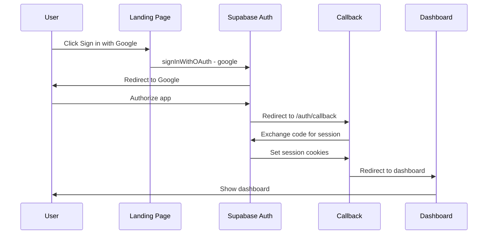
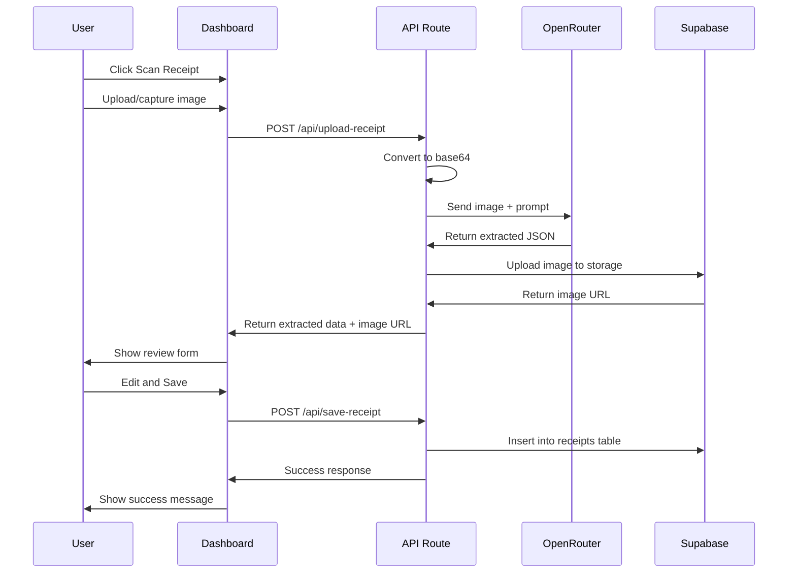

# Cosmoxis - AI-Powered Receipt Scanner

## Project Overview

Cosmoxis is a full-stack web application designed to help freelancers and small business owners digitize and manage receipts using AI-powered extraction. The application leverages OpenRouter's API with the Google Gemma 3 27B vision model to extract structured data from receipt images.

## Architecture Overview

```mermaid
flowchart TB
    subgraph Client [Next.js App Router]
        LP[Landing Page]
        AUTH[Auth Pages]
        DASH[Dashboard]
        RECEIPTS[Receipts Pages]
    end

    subgraph API [API Routes]
        UPLOAD[/api/upload-receipt]
        SAVE[/api/save-receipt]
        GETR[/api/receipts]
        STATS[/api/stats]
        EXPORT[/api/export-csv]
    end

    subgraph External [External Services]
        SUPA[Supabase]
        OR[OpenRouter API]
    end

    subgraph Storage [Data Layer]
        DB[(PostgreSQL)]
        BUCKET[Storage Bucket]
    end

    LP --> AUTH
    AUTH --> SUPA
    DASH --> UPLOAD
    DASH --> GETR
    DASH --> STATS
    UPLOAD --> OR
    UPLOAD --> BUCKET
    SAVE --> DB
    GETR --> DB
    STATS --> DB
    EXPORT --> DB
    SUPA --> DB
```

## Current Project State

The project is initialized with:

- **Next.js 16.1.6** with App Router
- **React 19.2.3**
- **Tailwind CSS 4**
- **TypeScript 5**

## Required Dependencies

### Core Dependencies

```json
{
  "@supabase/supabase-js": "^2.x",
  "@supabase/ssr": "^0.x",
  "@radix-ui/react-dialog": "^1.x",
  "@radix-ui/react-dropdown-menu": "^2.x",
  "@radix-ui/react-select": "^2.x",
  "@radix-ui/react-toast": "^1.x",
  "class-variance-authority": "^0.x",
  "clsx": "^2.x",
  "tailwind-merge": "^2.x",
  "lucide-react": "^0.x",
  "date-fns": "^3.x"
}
```

### Development Dependencies

- Already configured with ESLint, TypeScript, Tailwind CSS

## Project Structure

```
cosmoxis/
├── app/
│   ├── (auth)/
│   │   ├── login/
│   │   │   └── page.tsx              # Login page with Google OAuth
│   │   └── auth/
│   │       └── callback/
│   │           └── route.ts          # OAuth callback handler
│   ├── (dashboard)/
│   │   ├── dashboard/
│   │   │   └── page.tsx              # Main dashboard
│   │   ├── receipts/
│   │   │   └── page.tsx              # Receipt list with filters
│   │   └── layout.tsx                # Dashboard layout with nav
│   ├── api/
│   │   ├── upload-receipt/
│   │   │   └── route.ts              # Handle upload + AI extraction
│   │   ├── save-receipt/
│   │   │   └── route.ts              # Save to database
│   │   ├── receipts/
│   │   │   └── route.ts              # CRUD for receipts
│   │   ├── stats/
│   │   │   └── route.ts              # Monthly stats
│   │   └── export-csv/
│   │       └── route.ts              # CSV export
│   ├── layout.tsx                    # Root layout with Jost font
│   └── page.tsx                      # Landing page
├── components/
│   ├── ui/                           # shadcn/ui components
│   │   ├── button.tsx
│   │   ├── input.tsx
│   │   ├── select.tsx
│   │   ├── card.tsx
│   │   ├── toast.tsx
│   │   └── ...
│   ├── receipt-scanner.tsx           # Upload + camera capture
│   ├── receipt-form.tsx              # Review/edit form
│   ├── receipt-list.tsx              # Receipt list component
│   ├── stats-chart.tsx               # Spending chart
│   └── user-nav.tsx                  # User dropdown in nav
├── lib/
│   ├── supabase/
│   │   ├── client.ts                 # Browser client
│   │   ├── server.ts                 # Server client
│   │   └── middleware.ts             # Middleware helper
│   ├── utils.ts                      # Utility functions
│   └── openrouter.ts                 # OpenRouter API client
├── types/
│   └── index.ts                      # TypeScript types
├── middleware.ts                     # Route protection
├── tailwind.config.ts                # Tailwind configuration
└── .env.local                        # Environment variables
```

## Design System

### Color Palette

| Name               | Hex     | Usage                    |
| ------------------ | ------- | ------------------------ |
| Primary Background | #1F2937 | Main background          |
| Primary Accent     | #3670ED | CTAs, links, accents     |
| Text Primary       | #FFFFFF | Text on dark backgrounds |
| Text Secondary     | #9CA3AF | Muted text               |
| Success            | #10B981 | Success states           |
| Error              | #EF4444 | Error states             |

### Typography

- **Font Family**: Jost (Google Fonts)
- **Weights**: 300, 400, 500, 600, 700

### Component Styling

- Minimal, clean interfaces
- Generous whitespace
- Subtle shadows and borders
- Smooth transitions (200-300ms)
- Focus on functionality over decoration

## Authentication Flow



## Receipt Processing Flow



## Database Schema

### Tables

#### profiles

```sql
create table public.profiles (
  id uuid references auth.users on delete cascade primary key,
  email text,
  created_at timestamp default now()
);
```

#### receipts

```sql
create table public.receipts (
  id uuid primary key default uuid_generate_v4(),
  user_id uuid references auth.users(id) on delete cascade not null,
  merchant_name text,
  date date,
  total_amount decimal(10,2),
  currency text default 'USD',
  category text,
  notes text,
  image_url text,
  raw_extraction_json jsonb,
  confidence_score decimal(3,2),
  created_at timestamp default now()
);
```

### Row Level Security Policies

- Users can only view/insert/update/delete their own receipts
- Storage bucket with user-specific folder structure: `{user_id}/{receipt_id}.jpg`

## API Endpoints

### POST /api/upload-receipt

- Accepts multipart form data with image file
- Validates file type (jpg, png, pdf) and size (max 10MB)
- Converts image to base64
- Calls OpenRouter API with vision model
- Uploads image to Supabase Storage
- Returns extracted data + image URL

### POST /api/save-receipt

- Accepts receipt data JSON
- Validates user authentication
- Inserts into receipts table
- Returns saved receipt

### GET /api/receipts

- Returns paginated list of user's receipts
- Supports query params: page, limit, search, category, startDate, endDate

### GET /api/stats

- Returns monthly spending breakdown
- Groups by category
- Returns total and category totals

### GET /api/export-csv

- Generates CSV file of user's receipts
- Returns downloadable file

## Environment Variables

```env
# Supabase
NEXT_PUBLIC_SUPABASE_URL=your_supabase_url
NEXT_PUBLIC_SUPABASE_ANON_KEY=your_anon_key
SUPABASE_SERVICE_ROLE_KEY=your_service_role_key

# OpenRouter
OPENROUTER_API_KEY=your_openrouter_key
NEXT_PUBLIC_APP_URL=http://localhost:3000
```

## Implementation Phases

### Phase 1: Foundation

1. Install dependencies
2. Configure Tailwind with custom theme
3. Set up Jost font
4. Create environment variables template
5. Set up Supabase client utilities

### Phase 2: Authentication

1. Create middleware for route protection
2. Build login page
3. Implement OAuth callback handler
4. Create user navigation component

### Phase 3: Core Features

1. Build dashboard layout
2. Create receipt scanner component
3. Implement OpenRouter integration
4. Build receipt review form
5. Create API routes

### Phase 4: Dashboard & Data

1. Build main dashboard page
2. Create receipt list with filters
3. Implement stats chart
4. Add CSV export

### Phase 5: Polish

1. Add toast notifications
2. Implement error handling
3. Add loading states
4. Final testing and refinement

## Security Considerations

1. **Authentication**: All API routes verify Supabase session
2. **Row Level Security**: Database policies ensure data isolation
3. **File Validation**: Strict file type and size checks
4. **Input Sanitization**: All user inputs validated and sanitized
5. **API Key Protection**: Sensitive keys never exposed to client
6. **Storage Security**: User-specific folders with RLS policies

## Error Handling Strategy

1. **API Errors**: Graceful degradation with user-friendly messages
2. **OpenRouter Failures**: Retry logic with exponential backoff
3. **JSON Parsing**: Fallback to manual entry form
4. **Network Issues**: Offline indicators and retry options
5. **Validation Errors**: Inline form validation with clear messages

## Testing Checklist

- [ ] Google OAuth flow works correctly
- [ ] Protected routes redirect unauthenticated users
- [ ] File upload accepts valid formats
- [ ] Camera capture works on mobile
- [ ] AI extraction returns valid JSON
- [ ] Form validation works correctly
- [ ] Data saves to database
- [ ] RLS policies prevent unauthorized access
- [ ] CSV export generates valid file
- [ ] Stats calculations are accurate
- [ ] Responsive design works on all devices
